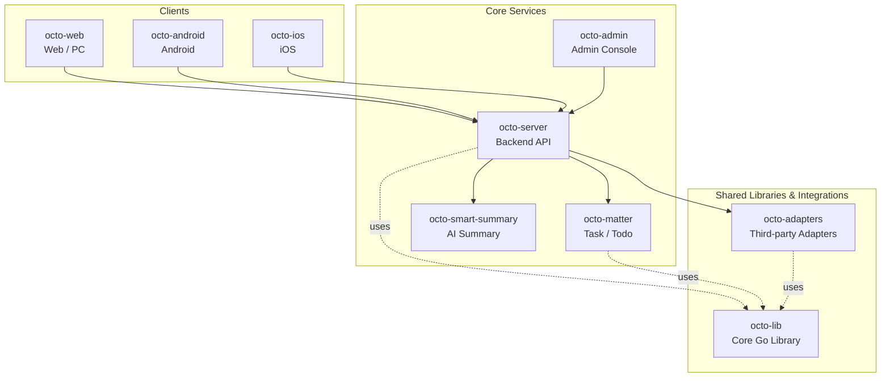

<p align="center">
  
  
</p>

<p align="center">
  <b>OCTO — the open workplace built for humans × AI agents.</b><br/>
  <sub>Let <b>Lobsters</b> (OpenClaw-powered digital doubles) do the <i>thinking</i> and <i>doing</i>. You focus on <i>taste</i>.</sub>
</p>

<p align="center">
  <a href="https://github.com/Mininglamp-OSS"><b>🏠 OCTO Home</b></a> ·
  <a href="#-quickstart"><b>🚀 Quickstart</b></a> ·
  <a href="#-octo-ecosystem"><b>📦 Ecosystem</b></a> ·
  <a href="./CONTRIBUTING.md"><b>🤝 Contributing</b></a>
</p>

<p align="center">
  <a href="./LICENSE"></a>
  <a href="./README.zh.md"></a>
</p>

---

> 🌐 **Read in**: **English** · [简体中文](README.zh.md)

# OCTO Admin

> **Admin console** for the OCTO platform — tenants, organisations, users, channels, and Lobster agent configuration from a single pane of glass.

`octo-admin` is the TypeScript / React console that platform operators use to
manage an OCTO deployment. It is a thin front-end over
[`octo-server`](https://github.com/Mininglamp-OSS/octo-server)'s admin APIs —
no business logic of its own, no side database. Everything you see or click
turns into a call into the main OCTO backend.

## 🌟 Why OCTO Admin

- **Operator console, not a second product.** `octo-admin` only exposes what `octo-server` already supports through its admin APIs. No shadow schema, no drift between "what the admin UI can do" and "what the backend actually enforces".
- **Separate surface, separate deploy.** The admin UI is a distinct bundle so ops can publish it on an internal URL (VPN-only, SSO-gated) while the user-facing `octo-web` goes on the public edge.
- **Built for day-2 work.** Tenant bootstrap, org / user audit, channel moderation, Lobster agent feature-flag toggles, webhook rotation — the screens are tuned for the "run OCTO in production" workflow, not the first-demo one.

## 🚀 Quickstart

```bash
git clone https://github.com/Mininglamp-OSS/octo-admin.git
cd octo-admin
pnpm install
pnpm dev
```

By default the dev build points at `http://localhost:8080` (the same
`octo-server` instance you'd run for `octo-web` development). Copy
`.env.example` to `.env.local` and edit `VITE_ADMIN_API_*` to aim it at a
different backend.

For a production build:

```bash
pnpm build        # emits static assets under ./dist
# serve ./dist behind an SSO-aware reverse proxy (nginx / envoy / ...)
```

Docker deployments proxy the primary admin API through `API_BACKEND` and the
Marketplace admin API through `MARKETPLACE_BACKEND`. Keep Marketplace admin
authentication on the user's Octo login token; do not ship marketplace service
credentials as `VITE_*` variables because Vite compiles them into the browser
bundle.

## 📦 Modules / Architecture

Top-level layout:

| Path | Purpose |
|---|---|
| `src/pages/` | Route-level views: tenants, orgs, users, channels, agents, audit log |
| `src/components/` | Admin UI kit — tables, filters, detail drawers, confirm dialogs |
| `src/store/` | Client state (current operator identity, active tenant scope, permissions) |
| `src/api/` | Typed client for the `octo-server` admin API surface |
| `src/locales/` | i18n resources (English · 简体中文) |
| `docs/` | Admin workflows, screenshots, deployment notes |

`octo-admin` talks to `octo-server` over the `/admin/*` REST surface. It
never talks to the primary database directly. Operator authentication is
delegated to `octo-server` (SSO or admin-token), and every mutation must
pass backend-side RBAC before it is persisted.

## 🔗 OCTO Ecosystem

<!-- shared snippet: OCTO repo matrix. Keep identical across all 9 repos. -->



| Repository | Language | Role |
|---|---|---|
| [`octo-server`](https://github.com/Mininglamp-OSS/octo-server) | Go | Backend API · business orchestration · Lobster agent scheduling |
| [`octo-matter`](https://github.com/Mininglamp-OSS/octo-matter) | Go | Task / Todo / Matter micro-service |
| [`octo-smart-summary`](https://github.com/Mininglamp-OSS/octo-smart-summary) | Go | LLM-powered conversation summarisation |
| [`octo-web`](https://github.com/Mininglamp-OSS/octo-web) | TypeScript / React | Web & PC (Electron) client |
| [`octo-android`](https://github.com/Mininglamp-OSS/octo-android) | Kotlin / Java | Native Android client |
| [`octo-ios`](https://github.com/Mininglamp-OSS/octo-ios) | Swift / Objective-C | Native iOS client |
| [`octo-admin`](https://github.com/Mininglamp-OSS/octo-admin) | TypeScript / React | Admin console (tenant / org / user / channel management) |
| [`octo-lib`](https://github.com/Mininglamp-OSS/octo-lib) | Go | Shared core library (protocol, crypto, storage, HTTP) |
| [`octo-adapters`](https://github.com/Mininglamp-OSS/octo-adapters) | TypeScript / Python | Third-party integrations (IM bridges, AI channels) |

## 🧭 Philosophy

OCTO ships under three shared principles that apply to every repository in this matrix:

1. **Local-first.** Anything that can run on the user's own box — chats, embeddings, agents — should. Your data stays yours; cloud is a choice, not a requirement.
2. **Humans judge, AI thinks and acts.** Humans focus on *taste* (what matters, what's right, what to ship). Lobster agents — OpenClaw-powered digital doubles — carry the *thinking* and *execution* load.
3. **Release-as-product.** Every open-source cut is shipped as a self-contained product, not a code dump: one squash per release, Apache 2.0, no internal baggage, reproducible from this repo alone.

## 🤝 Contributing

We love pull requests! Before you open one, please read:

- [CONTRIBUTING.md](CONTRIBUTING.md) — workflow, branch model, commit style
- [CODE_OF_CONDUCT.md](CODE_OF_CONDUCT.md) — community expectations

For security issues please follow [SECURITY.md](SECURITY.md) instead of the public tracker.

## 📄 License

Apache License 2.0 — see [LICENSE](LICENSE) for the full text and [NOTICE](NOTICE) for third-party attributions.

---

<p align="center">
  <sub>Made with 🐙 by <b>OCTO Contributors</b> · <a href="https://github.com/Mininglamp-OSS">Mininglamp-OSS</a></sub>
</p>
