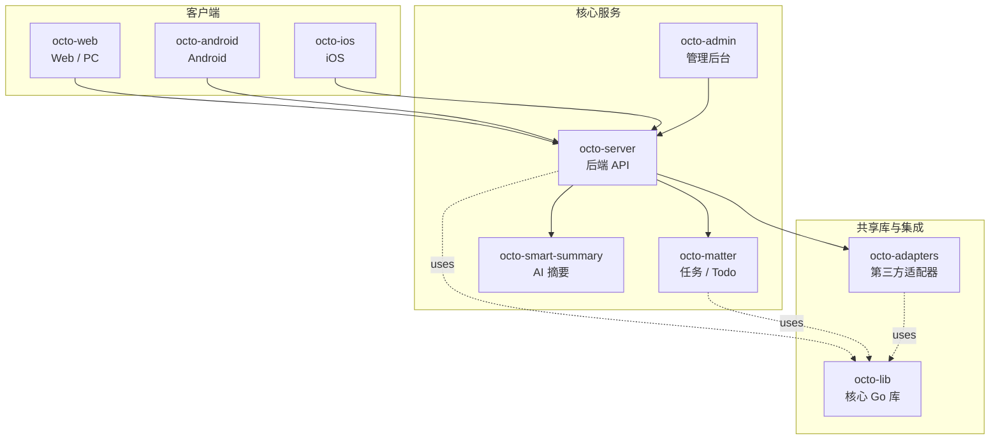

<p align="center">
  
  
</p>

<p align="center">
  <b>OCTO —— 为人和 AI Agent 协作而生的开源工作平台。</b><br/>
  <sub>让 <b>龙虾（Lobster / OpenClaw-powered digital double agents）</b>去「思」和「行」，让人专注于「品」。</sub>
</p>

<p align="center">
  <a href="https://github.com/Mininglamp-OSS"><b>🏠 OCTO 主页</b></a> ·
  <a href="#-快速开始"><b>🚀 快速开始</b></a> ·
  <a href="#-octo-生态"><b>📦 生态</b></a> ·
  <a href="./CONTRIBUTING.zh.md"><b>🤝 贡献</b></a>
</p>

<p align="center">
  <a href="./LICENSE"></a>
  <a href="./README.md"></a>
</p>

---

> 🌐 **语言**: [English](README.md) · **简体中文**

# OCTO Admin（简体中文）

> **管理后台** —— OCTO 平台的运营端：租户 / 组织 / 用户 / 频道 / Lobster Agent 配置的单一入口。

`octo-admin` 是由平台运营人员使用的 TypeScript / React 控制台。它是
[`octo-server`](https://github.com/Mininglamp-OSS/octo-server) 管理 API
之上的一层薄前端 —— 本身不承载业务逻辑，也不使用独立数据库。所有能在这里看到或
点到的操作最终都会调用到主 OCTO 后端。

## 🌟 为什么选 OCTO Admin

- **运营控制台，不是第二个产品。** `octo-admin` 只暴露 `octo-server` 管理 API 已经支持的能力。没有影子 schema，也不会出现「UI 能做但后端没实现」的漂移。
- **独立部署面。** 管理端是独立产物，运营方可以发布在内部 URL（仅 VPN、强制 SSO）上，而面向用户的 `octo-web` 走公网边缘。这两个面可以分别升级。
- **针对 Day-2 运营做的设计。** 租户初始化、组织 / 用户审计、频道审核、Lobster Agent feature-flag、Webhook 轮换 —— 所有屏幕都围绕「在生产环境运行 OCTO」的工作流，而不是首秀 demo。

## 🚀 快速开始

```bash
git clone https://github.com/Mininglamp-OSS/octo-admin.git
cd octo-admin
pnpm install
pnpm dev
```

默认 dev 构建会连接 `http://localhost:8080`（与 `octo-web` 开发时指向的
`octo-server` 是同一个）。如需换后端，复制 `.env.example` 为 `.env.local` 并
修改 `VITE_ADMIN_API_*` 字段。

生产环境构建：

```bash
pnpm build        # 产物写入 ./dist
# 将 ./dist 部署在支持 SSO 的反向代理后（nginx / envoy / ...）
```

## 📦 模块与架构

顶层结构：

| 路径 | 作用 |
|---|---|
| `src/pages/` | 页面级视图：租户 / 组织 / 用户 / 频道 / Agent / 审计日志 |
| `src/components/` | 管理 UI 套件 —— 表格、筛选器、详情抽屉、确认弹窗 |
| `src/store/` | 客户端状态（当前运营者身份、当前租户作用域、权限） |
| `src/api/` | `octo-server` 管理 API 的类型化客户端 |
| `src/locales/` | 多语言资源（英文 · 简体中文） |
| `docs/` | 管理工作流、截图、部署说明 |

`octo-admin` 通过 `/admin/*` REST 接口与 `octo-server` 通信，永远不直接访问
主数据库。运营者认证交由 `octo-server`（SSO 或 admin-token）处理，所有写操作
必须在后端的 RBAC 校验后才能落库。

## 🔗 OCTO 生态

<!-- 共享片段：OCTO 仓库矩阵。9 个仓库之间保持一致。 -->



| 仓库 | 语言 | 职责 |
|---|---|---|
| [`octo-server`](https://github.com/Mininglamp-OSS/octo-server) | Go | 后端 API · 业务编排 · 龙虾 Agent 调度 |
| [`octo-matter`](https://github.com/Mininglamp-OSS/octo-matter) | Go | 任务 / Todo / Matter 微服务 |
| [`octo-smart-summary`](https://github.com/Mininglamp-OSS/octo-smart-summary) | Go | 基于 LLM 的会话摘要服务 |
| [`octo-web`](https://github.com/Mininglamp-OSS/octo-web) | TypeScript / React | Web 与 PC（Electron）客户端 |
| [`octo-android`](https://github.com/Mininglamp-OSS/octo-android) | Kotlin / Java | 原生 Android 客户端 |
| [`octo-ios`](https://github.com/Mininglamp-OSS/octo-ios) | Swift / Objective-C | 原生 iOS 客户端 |
| [`octo-admin`](https://github.com/Mininglamp-OSS/octo-admin) | TypeScript / React | 管理后台（租户 / 组织 / 用户 / 频道管理） |
| [`octo-lib`](https://github.com/Mininglamp-OSS/octo-lib) | Go | 共享核心库（协议 / 加密 / 存储 / HTTP） |
| [`octo-adapters`](https://github.com/Mininglamp-OSS/octo-adapters) | TypeScript / Python | 第三方集成（IM 桥接、AI 渠道） |

## 🧭 设计哲学

OCTO 遵循三条共用原则 —— 这套矩阵里的每个仓都一致：

1. **本地优先（Local-first）。** 能跑在用户本机的一切（对话、向量、智能体）都应尽量在本机完成。你的数据属于你；云是可选项，不是前置条件。
2. **人做「品」，AI 做「思」与「行」。** 人聚焦在品味（什么重要、什么对、该发什么）。龙虾（OpenClaw 驱动的数字分身）承担思考与执行。
3. **Release-as-product（每次发布即产品）。** 每一次开源切片都是一个自洽的产品，不是代码倾倒：一个 release 一次 squash，Apache 2.0，不夹带内部包袱，单仓即可复现。

## 🤝 贡献

欢迎提 Pull Request！开 PR 前请先读：

- [CONTRIBUTING.zh.md](CONTRIBUTING.zh.md) —— 工作流、分支模型、commit 规范
- [CODE_OF_CONDUCT.zh.md](CODE_OF_CONDUCT.zh.md) —— 社区行为准则

安全问题请按 [SECURITY.zh.md](SECURITY.zh.md) 上报，不要走公开 issue。

## 📄 许可

Apache License 2.0 —— 完整文本见 [LICENSE](LICENSE)，第三方致谢见 [NOTICE](NOTICE)。

---

<p align="center">
  <sub>由 <b>OCTO Contributors</b> 🐙 共同开发 · <a href="https://github.com/Mininglamp-OSS">Mininglamp-OSS</a></sub>
</p>
